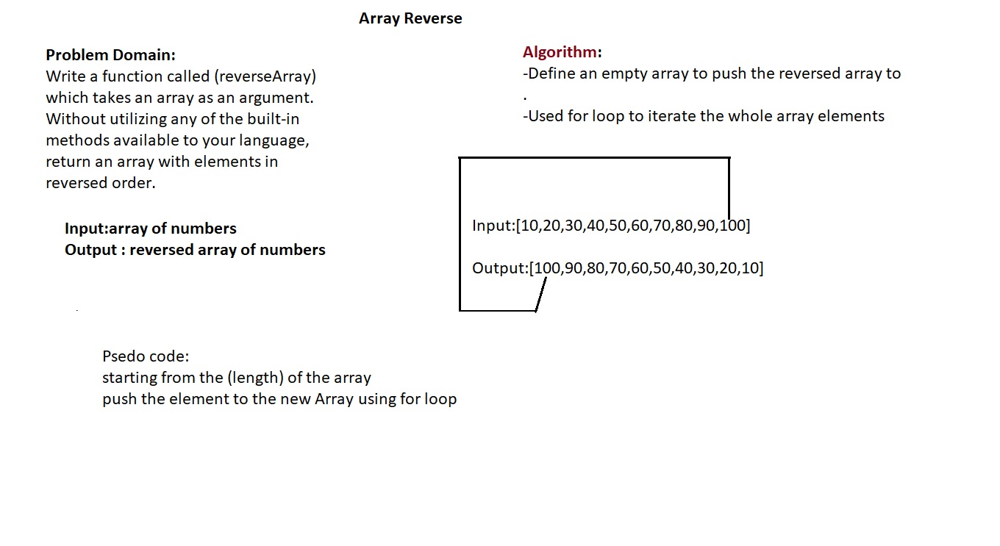
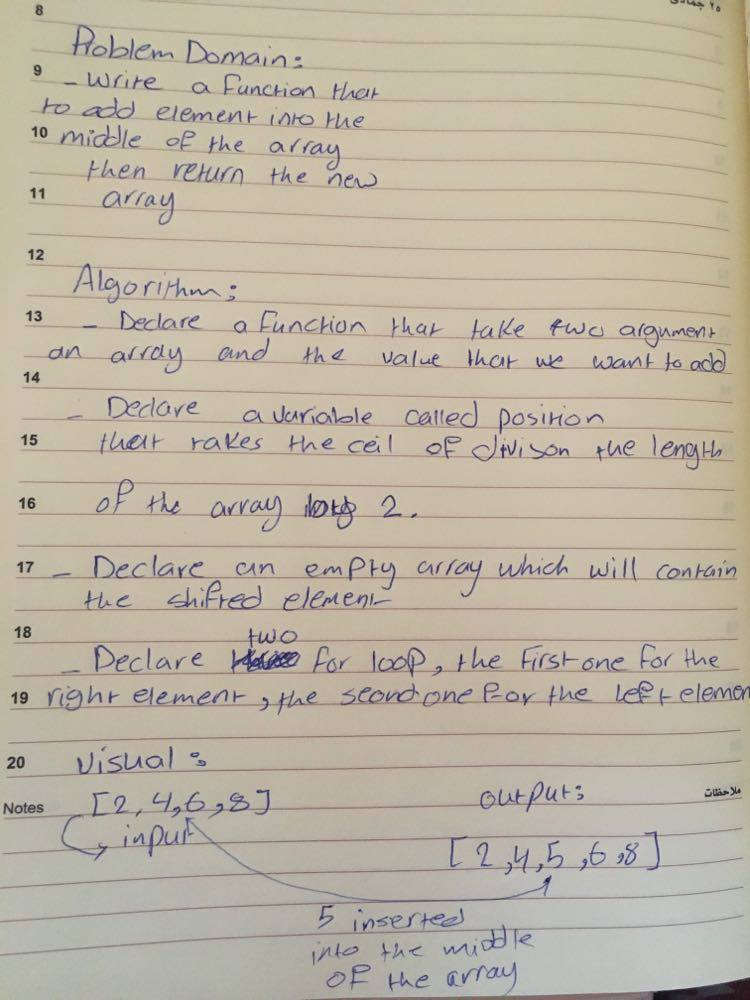

# Reverse an Array

## Challenge 01
Write a function called (*reverseArray*) which takes an array as an argument. Without utilizing any of the built-in methods available to your language, return an array with elements in reversed order.

## Approach & Efficiency
White borading the whole challenge.

## Solution

# ----------------------------------------------------------------
# Shift an array

## Challenge 02
Write a function called (*insertShiftArray*) which takes in an array and the value to be added. Without utilizing any of the built-in methods available to your language, return an array with the new value added at the middle index

## Approach & Efficiency
Two four loops , with no built-in methods 
## Solution
